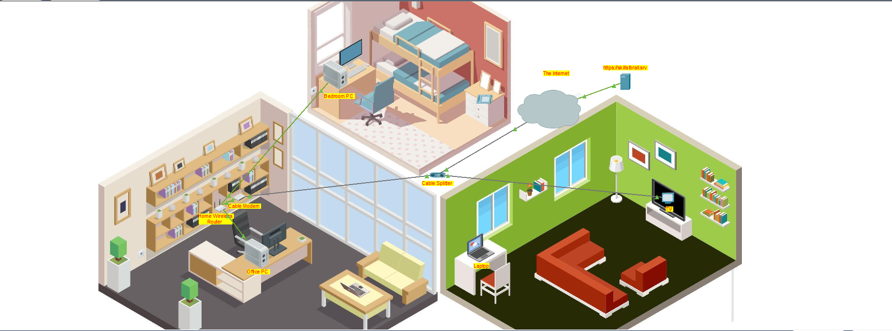

# Lab 01 - Configure a Wireless Router and Clients

---

# Lab Information

| Item | Details |
|------|---------|
| Module | Networking Foundations |
| Week | Week 01 |
| Difficulty | Beginner |
| Lab Type | Cisco Packet Tracer |
| Estimated Duration | 60 Minutes |
| Author | Quadri Akinjole |
| Date Completed | 2026-07-20 |

---

# Learning Objectives

This lab demonstrates the ability to:

- Connect network devices using the correct cable types.
- Configure a home wireless router.
- Configure DHCP for automatic IP address assignment.
- Configure a secure wireless network using WPA2 Personal.
- Connect wired and wireless devices to the network.
- Verify successful Internet connectivity.

---

# Scenario

## Scenario

A client requires a secure home network capable of providing Internet connectivity to both wired and wireless devices.

The network solution must:

- Provide automatic IP address allocation.
- Support secure wireless communication.
- Allow all connected devices to access the Internet.
- Follow basic security best practices by replacing default administrator credentials.

---

# Prerequisites

## Software

- Cisco Packet Tracer

## Required Knowledge

- Basic networking concepts
- IPv4 addressing
- Ethernet cabling
- DHCP fundamentals

---

# Network Topology

---

# Technologies Used

| Technology | Purpose |
|------------|---------|
| IPv4 | Network addressing |
| Ethernet | Wired communication |
| DHCP | Automatic IP assignment |
| TCP/IP | Network communication |
| Wireless LAN | Wireless connectivity |
| WPA2 Personal | Wireless security |

---

# Implementation

## Physical Connectivity

- Connected the cable modem to the cable splitter.
- Connected the cable modem to the wireless router using a copper straight-through cable.
- Connected both desktop computers to the router using Ethernet cables.

## Router Configuration

## Router Configuration

The wireless router was configured as the central networking device responsible for routing traffic between the local network and the Internet. DHCP was enabled to automatically assign IPv4 addresses to network clients, reducing manual configuration and minimizing addressing errors. The default administrator password was replaced with a strong custom password to improve device security. A wireless SSID was configured and protected using WPA2 Personal encryption to prevent unauthorized access.

## Client Configuration

- Configured Office PC for DHCP.
- Configured Bedroom PC for DHCP.
- Connected the laptop to the wireless network.
- Verified all devices received valid IP addresses.

---

## Verification & Testing

The implementation was verified using the following tests:

✅ Office PC obtained a valid IPv4 address via DHCP.

✅ Bedroom PC obtained a valid IPv4 address via DHCP.

✅ Laptop successfully authenticated to the wireless network.

✅ All devices successfully accessed the simulated Internet service (skillsforall.srv).

These results confirm successful network connectivity for both wired and wireless clients.

---

# Troubleshooting

| Issue | Cause | Resolution |
|------|------|------------|
| Example: No IP Address Assigned | DHCP lease not completed | Used Fast Forward Time to complete DHCP negotiation |

> If no issues were encountered during the lab, state:
>
> **No configuration issues were encountered during implementation.**

---

# Key Takeaways

- A home router performs multiple networking functions including routing, switching, DHCP and wireless access.
- DHCP simplifies network administration by automatically assigning IP addresses.
- Default router credentials should always be changed.
- WPA2 provides stronger wireless security than an open wireless network.

---

# Skills Demonstrated

- Network cabling
- Router configuration
- DHCP configuration
- Wireless LAN configuration
- Wireless security implementation
- Connectivity verification
- Basic troubleshooting
- Technical documentation

---

# Evidence

## Packet Tracer File

The completed Cisco Packet Tracer lab can be downloaded below.

📥 [Download Packet Tracer Lab](PacketTracer/home-network-wireless-router.pka)

## Diagrams

# Network Topology

The following topology illustrates the completed home network implemented in Cisco Packet Tracer.

---

# Next Steps

- Configure static IPv4 addressing.
- Compare DHCP and Static IP addressing.
- Learn subnetting.
- Configure multiple VLANs.
- Configure routing between networks.