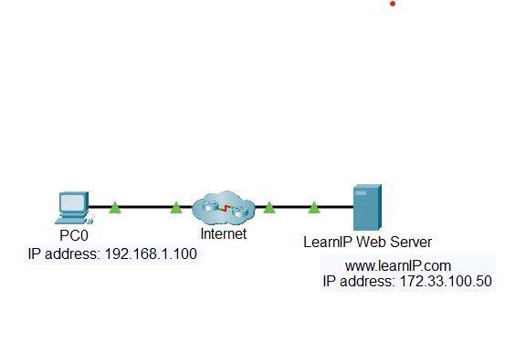
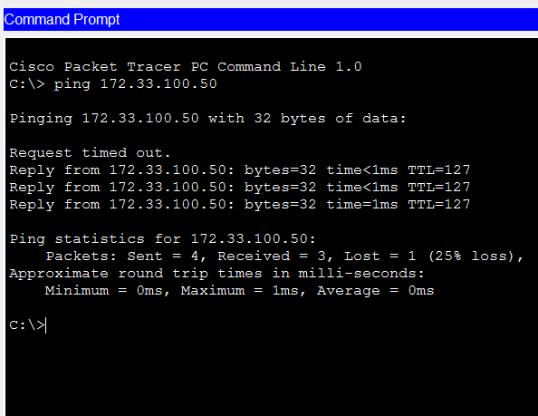
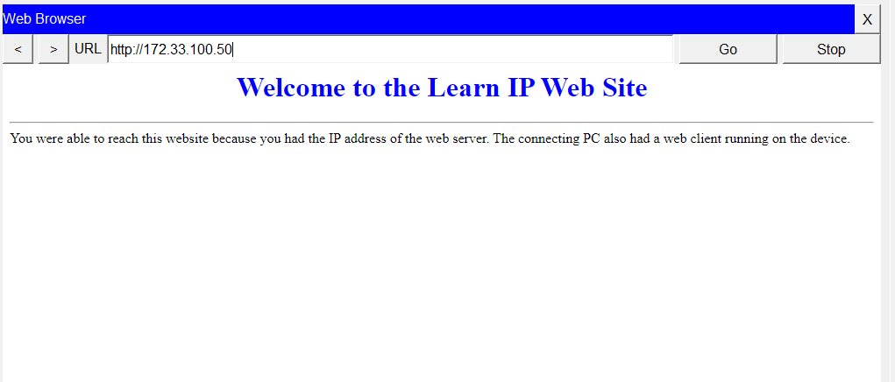

# Lab 02 - Connect to a Web Server

---

# Lab Information

| Item | Details |
|------|---------|
| Module | Networking Foundations |
| Week | Week 02 |
| Difficulty | Beginner |
| Lab Type | Cisco Packet Tracer |
| Estimated Duration | 30 Minutes |
| Author | Quadri Akinjole |
| Date Completed | 2026-07-27 |

---

# Learning Objectives

This lab demonstrates the ability to:

- Verify network connectivity using the `ping` command.
- Connect to a remote web server using its IPv4 address.
- Observe how Internet Protocol (IP) enables communication between devices.
- Access a web page hosted on a web server through a web client.

---

# Scenario

A client computer needs to verify connectivity to a remote web server before accessing a hosted web page.

The objectives are to:

- Test connectivity to the web server.
- Access the web server using its IPv4 address.
- Verify successful communication between the client and the server.

---

# Prerequisites

## Software

- Cisco Packet Tracer

## Required Knowledge

- Communication Principles
- Network Media
- Access Layer
- Internet Protocol (IP)

---

# Network Topology


---

# Technologies Used

| Technology | Purpose |
|------------|---------|
| IPv4 | Network addressing |
| ICMP | Connectivity testing using ping |
| ARP | Address resolution |
| Ethernet | Wired communication |
| HTTP | Web communication |
| Web Browser | Accessing the web server |

---

# Implementation

## Connectivity Test

- Opened the Command Prompt on PC0.
- Sent ICMP echo requests to the web server using:

```text
ping 172.33.100.50
```

- Verified successful replies from the destination server.

## Web Server Access

- Opened the Web Browser on PC0.
- Entered the destination IP address:

```text
172.33.100.50
```

- Successfully loaded the hosted web page.

---

# Verification & Testing

The following tests were performed:

- PC0 successfully reached the destination server using `ping`.
- The web server responded with ICMP replies.
- The web page loaded successfully in the web browser.
- Verified end-to-end connectivity between the client and the web server.

---

# Troubleshooting

| Issue | Cause | Resolution |
|------|------|------------|
| Initial ping request timed out | ARP resolution had not completed | Repeated the ping after ARP completed |

> If no issues were encountered during the lab, state:
>
> **No configuration issues were encountered during implementation.**

---

# Key Takeaways

- The `ping` command is used to verify network connectivity between devices.
- A successful ping confirms that the destination device is reachable over the network.
- A web browser can access a web server directly using its IPv4 address.
- ARP may cause the first ping request to timeout while resolving MAC addresses.

---

# Skills Demonstrated

- Basic network connectivity testing
- IPv4 communication
- ICMP troubleshooting
- Web server connectivity
- Client-server communication
- Technical documentation

---

# Evidence

## Packet Tracer File

The completed Cisco Packet Tracer lab can be downloaded below.

📥 [Download Packet Tracer Lab](PacketTracer/Connect-to-a-Web Server.pka)

## Diagram








---

# Next Steps

- Observe packet flow using Simulation Mode.
- Explore how DNS translates domain names into IP addresses.
- Compare ICMP and HTTP traffic.
- Learn how routers forward packets between networks.