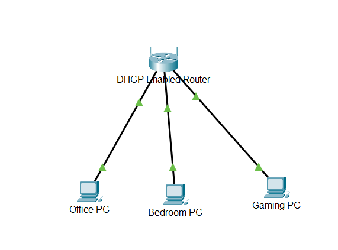
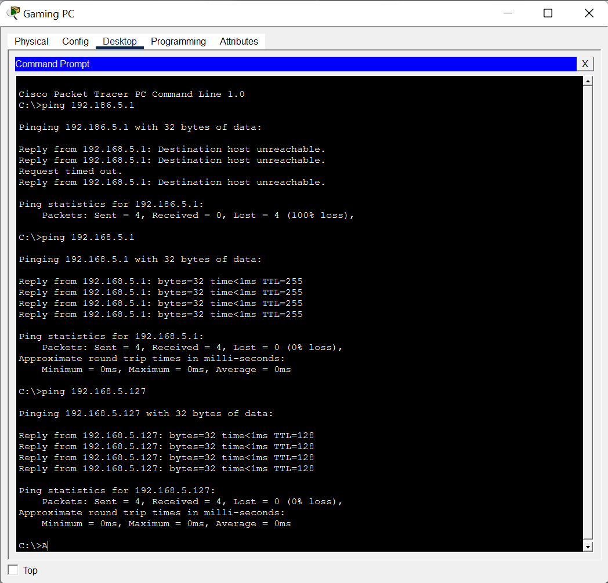

# Lab 03 - Configure Dynamic Addressing with DHCP

---

# Lab Information

| Item | Details |
|------|---------|
| Module | Networking Foundations |
| Week | Week 03 |
| Difficulty | Beginner |
| Lab Type | Cisco Packet Tracer |
| Estimated Duration | 45 Minutes |
| Author | Quadri Akinjole |
| Date Completed | 2026-08-02 |

---

# Learning Objectives

This lab demonstrates the ability to:

- Configure a DHCP-enabled network.
- Understand the advantages of dynamic IP addressing.
- Verify IPv4 connectivity between multiple hosts.
- Observe how DHCP automatically assigns network configuration to clients.
- Troubleshoot connectivity issues using the `ping` command.

---

# Scenario

A small home network requires automatic IP address allocation for multiple client devices.

To simplify network administration, a DHCP-enabled router is deployed to dynamically assign IPv4 addresses to connected hosts.

The objectives are to:

- Configure DHCP services on the router.
- Verify that all clients obtain valid IPv4 addresses automatically.
- Test communication between devices on the local network.
- Identify and resolve connectivity issues through basic troubleshooting.

---

# Prerequisites

## Software

- Cisco Packet Tracer

## Required Knowledge

- IPv4 Address Segmentation
- IPv6 Address Rules and Format
- Dynamic Host Configuration Protocol (DHCP)
- Basic Network Connectivity Testing

---

# Network Topology

The completed network topology consists of a DHCP-enabled router connected to three client devices.

- Office PC
- Bedroom PC
- Gaming PC



---

# Technologies Used

| Technology | Purpose |
|------------|---------|
| IPv4 | Network addressing |
| DHCP | Automatic IP address assignment |
| Ethernet | Wired communication |
| ICMP | Connectivity verification |
| ARP | MAC address resolution |

---

# Implementation

## Network Setup

A DHCP-enabled router was configured to automatically distribute IPv4 addressing information to all connected client devices.

Unlike static addressing, no manual IP configuration was required on the clients.

To make the topology more representative of a real deployment, the default Packet Tracer device names were replaced with:

- Office PC
- Bedroom PC
- Gaming PC

## Address Assignment

Each client successfully received an IPv4 address from the DHCP server.

The automatically assigned configuration included:

- IPv4 Address
- Subnet Mask
- Default Gateway

## Connectivity Verification

Connectivity testing was performed from the Gaming PC using the Command Prompt.

The following tests were carried out:

### Test 1 – Invalid Destination

An attempt was made to communicate with an incorrect IPv4 address.

```text
ping 192.186.5.1
```

The request failed, returning **Destination host unreachable** and **Request timed out** messages.

This demonstrated that communication cannot be established when the destination IP address is incorrect.

### Test 2 – Default Gateway

The Gaming PC successfully communicated with the default gateway.

```text
ping 192.168.5.1
```

All packets were successfully received.

### Test 3 – Client-to-Client Communication

The Gaming PC successfully communicated with another client device.

```text
ping 192.168.5.127
```

All packets were transmitted successfully with **0% packet loss**, confirming proper local network connectivity.

---

# Verification & Testing

The following checks confirmed a successful implementation:

- DHCP automatically assigned valid IPv4 addresses to all client devices.
- All devices received the correct network configuration.
- The Gaming PC successfully communicated with the default gateway.
- The Gaming PC successfully communicated with another host on the network.
- Connectivity failures caused by an incorrect destination address were identified and interpreted correctly.

---

# Troubleshooting

| Issue | Cause | Resolution |
|------|------|------------|
| Destination host unreachable | Incorrect IPv4 address entered during testing | Corrected the destination IP address and repeated the test |
| Request timed out | Invalid destination prevented successful communication | Verified the correct addressing information before testing |

---

# Technical Observations

- DHCP significantly reduces manual network configuration by automatically assigning IPv4 addresses.
- Verifying connectivity with the default gateway is an effective first step when troubleshooting local networks.
- "Destination host unreachable" typically indicates that the destination cannot be reached using the specified address.
- A successful ping with **0% packet loss** confirms end-to-end Layer 3 connectivity between devices.
- Renaming network devices improves readability and makes network documentation more meaningful.

---

# Skills Demonstrated

- DHCP configuration
- IPv4 addressing
- Dynamic host configuration
- Network verification
- ICMP troubleshooting
- Client-to-client communication
- Technical documentation

---

# Evidence

## Packet Tracer File

[Configure-DHCP.pka](PacketTracer/Configure-DHCP.pka)

## Screenshots

### Gaming PC Connectivity Test



---

# Next Steps

- Configure static IPv4 addressing and compare it with DHCP.
- Explore DHCP lease renewal and release operations.
- Introduce DNS into the network configuration.
- Capture DHCP traffic using Simulation Mode to observe the DORA process (Discover, Offer, Request, Acknowledge).