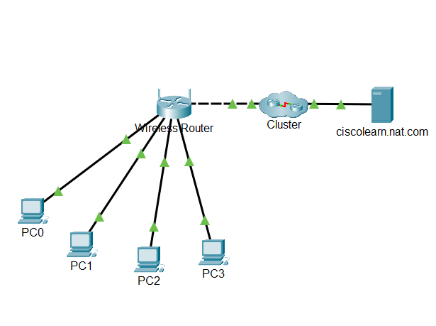
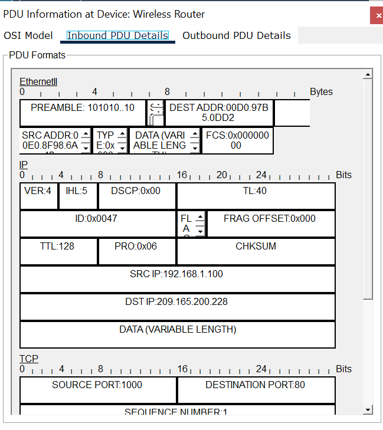

# Lab 04 - Examine NAT on a Wireless Router

---

# Lab Information

| Item | Details |
|------|---------|
| Module | Networking Foundations |
| Week | Week 04 |
| Difficulty | Beginner |
| Lab Type | Cisco Packet Tracer |
| Estimated Duration | 45 Minutes |
| Author | Quadri Akinjole |
| Date Completed | 2026-08-02 |

---

# Learning Objectives

This lab demonstrates the ability to:

- Configure client devices to obtain IP addresses through DHCP.
- Examine Network Address Translation (NAT) on a wireless router.
- Differentiate between private and public IPv4 addresses.
- Observe packet translation as traffic moves between the local network and the Internet.
- Verify communication between internal hosts and an external web server.

---

# Scenario

A home network consisting of four client devices requires Internet access through a single wireless router.

The wireless router acts as both the DHCP server and the Network Address Translation (NAT) device, allowing multiple internal hosts to communicate with external networks using one public IPv4 address.

The objectives are to:

- Configure client devices using DHCP.
- Examine the router's WAN and LAN configurations.
- Observe NAT in action using Simulation Mode.
- Understand how private addresses are translated into a public address before reaching the Internet.

---

# Prerequisites

## Software

- Cisco Packet Tracer

## Required Knowledge

- IPv4 Addressing
- DHCP
- Public vs Private IP Addresses
- Basic Router Configuration
- Packet Tracer Simulation Mode

---

# Network Topology

The topology consists of four client devices connected to a wireless router. The router provides DHCP services to the internal network and NAT services for Internet connectivity through the ISP network.



---

# Technologies Used

| Technology | Purpose |
|------------|---------|
| IPv4 | Network addressing |
| DHCP | Automatic IP address assignment |
| NAT | Translation of private addresses to a public address |
| Ethernet | Local network communication |
| TCP | Reliable transport |
| HTTP | Communication with the web server |

---

# Implementation

## DHCP Configuration

Each client device was configured to obtain an IPv4 address automatically from the wireless router using DHCP.

The router dynamically assigned:

- IPv4 Address
- Subnet Mask
- Default Gateway

This eliminated the need for manual configuration.

---

## Router Examination

The router's configuration was examined to identify:

- Public IPv4 address assigned by the ISP.
- Private IPv4 network used by the internal LAN.
- DHCP address pool.
- Default gateway configuration.

This demonstrated the separation between the public Internet and the private home network.

---

## NAT Examination

Simulation Mode was used to inspect packet flow.

A client initiated communication with the external web server.

During packet processing, the router translated the packet's source address before forwarding it to the Internet.

This confirmed that NAT allows multiple internal devices to share a single public IPv4 address.

---

# Verification & Testing

The following checks confirmed successful implementation:

- All client devices received IPv4 addresses through DHCP.
- The router obtained a valid public IPv4 address from the ISP.
- Internal devices successfully communicated with the external web server.
- Simulation Mode confirmed successful NAT translation.
- Packet delivery completed successfully without errors.

---

# Packet Analysis

## Inbound PDU

The inbound packet arrived at the wireless router carrying the client's private IPv4 address.

Source Address:

```
192.168.1.100
```

Destination Address:

```
209.165.200.228
```

This represents the packet before NAT translation.



---

## Outbound PDU

Before leaving the router, NAT translated the private source address into the router's public IPv4 address.

Source Address:

```
209.165.200.227
```

Destination Address:

```
209.165.200.228
```

Only the source address changed.

The destination remained the same.

This demonstrates how NAT hides internal network addressing from external networks.


---

# Technical Observations

- Private IPv4 addresses cannot be routed across the public Internet.
- NAT replaces the private source IPv4 address with the router's public IPv4 address.
- Multiple internal devices can share one public IPv4 address simultaneously.
- DHCP and NAT often operate together on home and small business routers.
- Packet Tracer Simulation Mode provides a clear visualization of packet translation at the router.

---

# Skills Demonstrated

- DHCP configuration
- IPv4 addressing
- Public and private addressing
- NAT analysis
- Packet inspection
- Simulation Mode analysis
- Network troubleshooting
- Technical documentation

---

# Evidence

## Packet Tracer File

[Examine-NAT-on-a-Wireless-Router.pka](PacketTracer/Examine-NAT-on-a-Wireless-Router.pka)

## Screenshots


### Inbound PDU


### Outbound PDU


---

# Next Steps

- Examine Port Address Translation (PAT).
- Compare static NAT and dynamic NAT.
- Explore NAT behavior in enterprise networks.
- Capture and analyze NAT traffic using Wireshark.