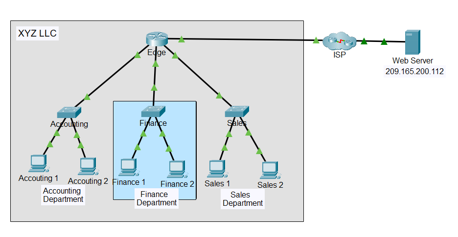

# Lab 05 - Observe Traffic Flow in a Routed Network

---

# Lab Information

| Item | Details |
|------|---------|
| Module | Networking Foundations |
| Week | Week 05 |
| Difficulty | Intermediate |
| Lab Type | Cisco Packet Tracer |
| Estimated Duration | 60 Minutes |
| Author | Quadri Akinjole |
| Date Completed | 2026-08-04 |

---

# Learning Objectives

Upon completion of this lab, I was able to:

- Observe traffic flow within a single LAN.
- Compare communication in unrouted and routed networks.
- Understand how routing improves communication between departments.
- Analyze packet forwarding using Packet Tracer Simulation Mode.
- Examine Layer 2 and Layer 3 addressing during packet transmission.

---

# Scenario

XYZ LLC is experiencing network performance issues because all departments share a single IPv4 network. As the company expands, the existing flat network design becomes inefficient due to increased broadcast traffic.

This lab demonstrates how introducing routing between departmental networks improves network organization and communication while maintaining connectivity to external resources.

---

# Prerequisites

## Software

- Cisco Packet Tracer

## Required Knowledge

- IPv4 Addressing
- Ethernet
- ARP
- Routing Fundamentals
- Packet Tracer Simulation Mode

---

# Network Topology

The enterprise network consists of three departmental LANs connected to an edge router, which provides connectivity to an ISP and an external web server.

Departments include:

- Accounting
- Finance
- Sales

---

# Technologies Used

| Technology | Purpose |
|------------|---------|
| IPv4 | Network addressing |
| Ethernet | Local network communication |
| ARP | MAC address resolution |
| Routing | Communication between separate networks |
| ICMP | Connectivity verification |
| HTTP | Access to external web resources |

---

# Implementation

## Part 1 – Observe Traffic in an Unrouted LAN

The initial network operated as a single IPv4 network where all departmental hosts belonged to the same broadcast domain.

Using Packet Tracer Simulation Mode:

- Cleared the ARP cache.
- Generated ICMP traffic between Sales department hosts.
- Captured packets as they traversed the network.
- Observed ARP broadcasts before successful communication.

---

## Part 2 – Reconfigure the Network

The network was reconfigured into separate departmental LANs.

Each department received its own network segment while the Edge router was configured to route traffic between them.

Departments configured:

- Accounting
- Finance
- Sales

---

## Part 3 – Observe Traffic in the Routed Network

Simulation Mode was used again after routing was enabled.

Packet forwarding was observed between different departmental networks.

The router successfully forwarded packets between networks while maintaining communication with the external web server.

---

# Verification & Testing

The following tests confirmed successful implementation:

- ARP successfully resolved MAC addresses before communication.
- Devices communicated successfully within their local networks.
- Inter-department communication succeeded after routing was configured.
- External web server remained reachable through the Edge router.
- Simulation Mode verified successful packet forwarding.

---

# Troubleshooting

| Issue | Cause | Resolution |
|------|------|------------|
| Initial communication delayed | Empty ARP cache | Allowed ARP resolution before packet forwarding |
| Inter-network communication unavailable before routing | Networks were isolated | Configured routing through the Edge router |

---

# Technical Observations

- Hosts within the same network communicate directly using MAC addresses.
- ARP resolves destination MAC addresses before data transmission.
- Routing enables communication between separate IPv4 networks.
- Separating departments into individual networks reduces unnecessary broadcast traffic.
- Simulation Mode provides visibility into frame and packet forwarding across the network.

---

# Skills Demonstrated

- Enterprise network design
- Routing fundamentals
- ARP analysis
- Packet flow analysis
- Simulation Mode
- Layer 2 and Layer 3 communication
- Network troubleshooting
- Technical documentation

---

# Evidence

## Packet Tracer File

Routed-Network.pka

---

# Next Steps

- Configure static routing between multiple routers.
- Explore dynamic routing protocols.
- Learn subnetting for enterprise networks.
- Examine routing tables and packet forwarding decisions.