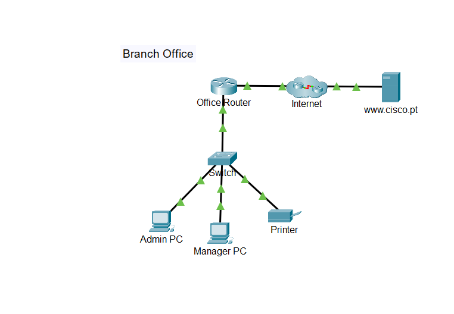
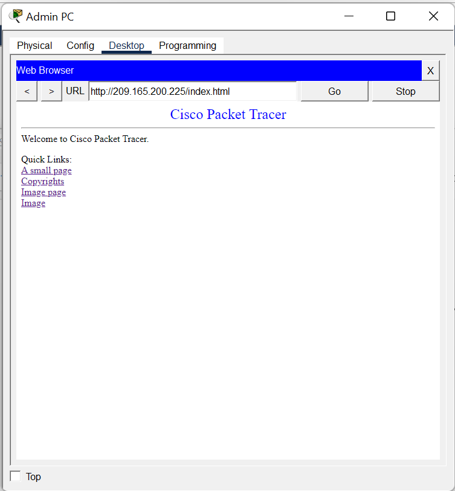
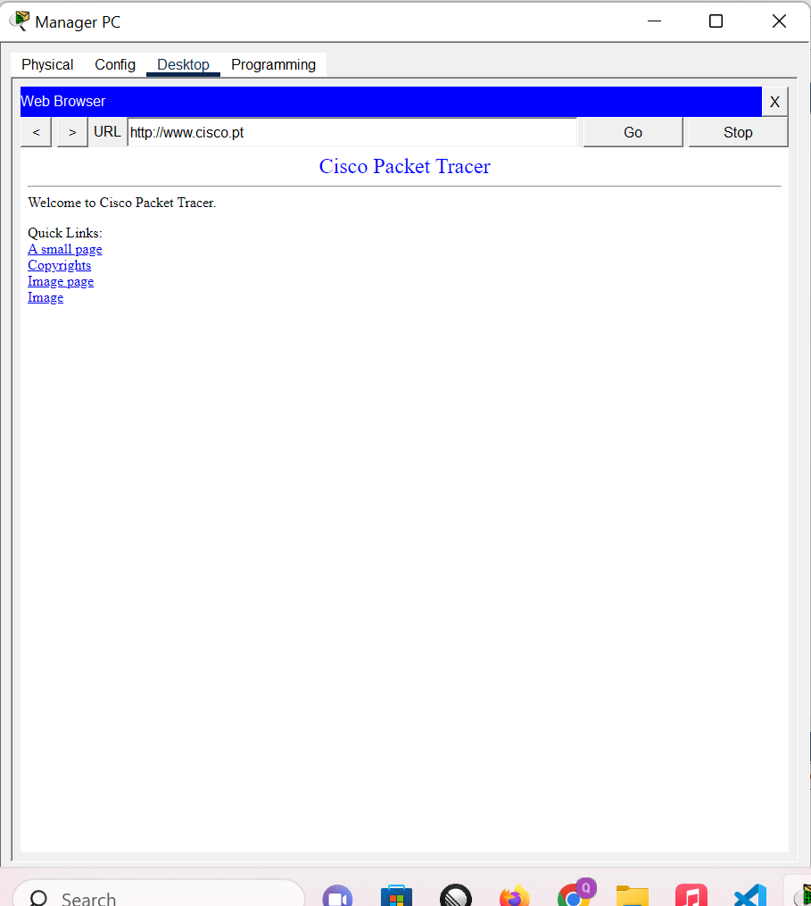

# Lab 06 - Create a LAN

---

# Lab Information

| Item | Details |
|------|---------|
| Module | Networking Foundations |
| Week | Week 06 |
| Difficulty | Beginner |
| Lab Type | Cisco Packet Tracer |
| Estimated Duration | 45 Minutes |
| Author | Quadri Akinjole |
| Date Completed | 2026-08-05 |

---

# Learning Objectives

Upon completing this lab, I was able to:

- Build a small Local Area Network (LAN).
- Connect networking devices using the appropriate cabling.
- Configure IPv4 addressing through DHCP.
- Verify communication between local hosts.
- Test DNS name resolution.
- Access remote web resources through the Internet.

---

# Scenario

A new branch office is being deployed. The network infrastructure has already been installed, but the end devices still need to be connected and configured.

The objective is to complete the LAN installation, obtain IPv4 addressing, verify communication within the local network, and confirm access to external resources through the Internet.

---

# Prerequisites

## Software

- Cisco Packet Tracer

## Required Knowledge

- IPv4 Addressing
- DHCP
- DNS
- Ethernet
- ICMP
- Basic Web Browsing

---

# Network Topology

The network consists of:

- Office Router
- Layer 2 Switch
- Admin PC
- Manager PC
- Network Printer
- Internet Cloud
- Cisco Web Server

```
                 Internet
                     │
              www.cisco.pt
                     │
                 Office Router
                     │
                 Layer 2 Switch
          ┌──────────┼──────────┐
          │          │          │
     Admin PC   Manager PC   Printer
```

---

# Technologies Used

| Technology | Purpose |
|------------|---------|
| Ethernet | Physical connectivity |
| DHCP | Automatic IP addressing |
| DNS | Name resolution |
| IPv4 | Host addressing |
| ICMP | Connectivity testing |
| HTTP | Web access |

---

# Implementation

## Part 1 – Build the LAN

The following devices were connected:

- Office Router
- Switch
- Admin PC
- Manager PC
- Printer

Appropriate Ethernet cabling was used to establish physical connectivity.

---

## Part 2 – Configure End Devices

The Admin PC and Manager PC were configured to obtain their IPv4 addresses automatically using DHCP.

The printer used a static IPv4 address as provided in the addressing table.

---

## Part 3 – Verify Local Connectivity

Connectivity tests included:

- Ping from Admin PC to Manager PC
- Ping from Admin PC to Printer
- Ping to the default gateway

All tests completed successfully, confirming that the LAN was operating correctly.

---

## Part 4 – Verify DNS Resolution

The web browser on both PCs was used to test DNS functionality.

DNS successfully resolved:

www.cisco.pt

to

209.165.200.225

The website loaded correctly using both:

- Hostname
- Direct IP address

---

# Verification & Testing

The following checks were completed successfully:

✅ DHCP assigned IPv4 addresses to both PCs.

✅ Local hosts communicated successfully using ICMP.

✅ DNS resolved the hostname to the correct IPv4 address.

✅ Remote web server was accessible using:

- http://www.cisco.pt
- http://209.165.200.225/index.html

---

# Troubleshooting

| Issue | Cause | Resolution |
|------|------|------------|
| No IP address | DHCP unavailable | Renew DHCP lease |
| Unable to browse | DNS failure | Verified DNS configuration |
| Ping unsuccessful | Incorrect cabling | Checked physical connections |

---

# Technical Observations

- DHCP simplifies host deployment by assigning IP addresses automatically.
- DNS eliminates the need for users to remember IP addresses.
- LAN communication occurs before traffic is forwarded to external networks.
- The default gateway enables communication beyond the local subnet.
- Web browsing depends on successful IP addressing, routing, and DNS resolution.

---

# Skills Demonstrated

- LAN installation
- Ethernet cabling
- DHCP configuration
- DNS verification
- ICMP testing
- Web connectivity testing
- Basic network troubleshooting
- Packet Tracer proficiency

---

# Evidence

## Packet Tracer File


## Screenshots

### Network Topology



### Browser Access

### Admin PC accessing http://209.165.200.225/index.html



### Manager PC accessing http://www.cisco.pt



### Connectivity

- Successful ping tests
- DHCP-assigned IP addresses

---

# Key Takeaways

This lab demonstrated the complete deployment of a small office LAN from physical connectivity to Internet access. By integrating DHCP, DNS, and routing through the Office Router, end devices were able to communicate locally and access remote web resources successfully. It reinforced the relationship between Layer 2 switching, Layer 3 routing, automatic IP addressing, and DNS name resolution in a real-world branch office environment.